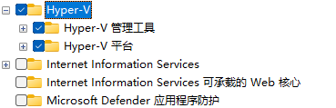
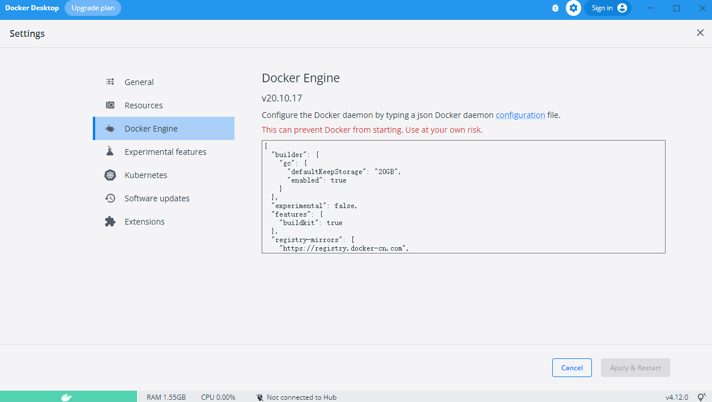

# Win11下安装Docker Desktop


## 1 前置条件

### 1.1 配置win11虚拟化

#### 1.1.1 主板开启虚拟化

首先针对不同主板开启虚拟化，这样windows才支持安装虚拟机以及wsl


#### 1.1.2  开启windows的Hpyer-V功能

打开启用和关闭windows功能配置，选中Hyper-V全部选项

> Hyper-V: 提供一些帮助创建和运行虚拟机及其他资源的服务和管理工具





### 1.2  配置Wsl2

安装wsl2的Linux内核[下载地址](https://docs.microsoft.com/zh-cn/windows/wsl/install-manual#step-4---download-the-linux-kernel-update-package)

直接安装即可


### 1.3 下载Docker Desktop

首先去官网下载[docker安装包](https://desktop.docker.com/win/main/amd64/Docker%20Desktop%20Installer.exe?utm_source=docker&amp;utm_medium=webreferral&amp;utm_campaign=dd-smartbutton&amp;utm_location=module)

直接安装即可


### 1.4 配置doker国内镜像




配置如下：

```json
{
  "builder": {
    "gc": {
      "defaultKeepStorage": "20GB",
      "enabled": true
    }
  },
  "experimental": false,
  "features": {
    "buildkit": true
  },
  "registry-mirrors": [
    "https://registry.docker-cn.com",
    "http://f1361db2.m.daocloud.ioAzure",
    "https://dockerhub.azk8s.cn",
    "https://docker.mirrors.ustc.edu.cn",
    "https://docker.mirrors.ustc.edu.cn",
    "https://registry.docker-cn.com",
    "http://hub-mirror.c.163.com",
    "https://mirror.ccs.tencentyun.com",
    "https://reg-mirror.qiniu.com"
  ]
}
```

